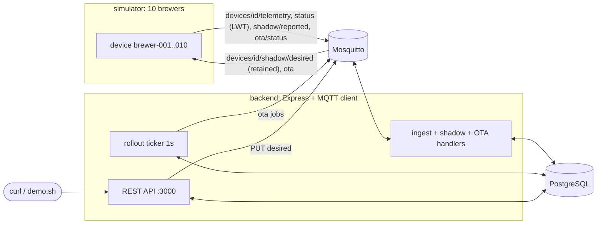

# brewfleet

A small local IoT fleet simulator: connected coffee brewers talk MQTT to a backend that
ingests telemetry, tracks device shadows, and runs staged firmware rollouts.
TypeScript/Node, Mosquitto, PostgreSQL, all under `docker compose`.

```bash
docker compose up -d --build
./demo.sh            # needs curl + jq
```

## Architecture



### Topics

| Topic | Direction | Payload |
|---|---|---|
| `devices/{id}/telemetry` | device → backend | `{ts, waterTempC, state, firmwareVersion}` |
| `devices/{id}/status` | device → backend (retained, Last Will) | `{online}` |
| `devices/{id}/shadow/desired` | backend → device (retained) | `{version, state}` |
| `devices/{id}/shadow/reported` | device → backend | `{version, state}` |
| `devices/{id}/ota` | backend → device | `{jobId, version}` |
| `devices/{id}/ota/status` | device → backend | `{jobId, status: IN_PROGRESS\|SUCCEEDED\|FAILED, version}` |
| `sim/config` | you → simulator | `{otaFailureRate, otaDelayMs}` (changes behaviour live) |

### Files

```
docker-compose.yml          mosquitto, postgres, backend, simulator
mosquitto/mosquitto.conf    anonymous listener on 1883
simulator/src/device.ts     one brewer: telemetry loop, shadow apply, OTA, Last Will
simulator/src/index.ts      spawns N devices, listens on sim/config
backend/migrations/*.sql    schema, applied once each on startup (tracked in schema_migrations)
backend/src/db.ts           pg pool, transaction helper, migration runner
backend/src/transport/     the seam between backend and device network (see "Transports")
  types.ts                  Transport + DeviceEvents interfaces
  topics.ts                 topic convention + routeInbound (topic -> DeviceEvents call)
  mosquitto.ts              MQTT implementation (local)
  aws.ts                    IoT Core publish + SQS consume implementation
  index.ts                  picks one from the TRANSPORT env var
backend/src/devices.ts      telemetry + online status ingest
backend/src/shadow.ts       desired / reported / delta
backend/src/ota.ts          staged rollouts
backend/src/routes.ts       REST endpoints
backend/src/index.ts        wiring
demo.sh                     end-to-end walkthrough
infra/*.tf                  Terraform for the AWS side (see "AWS infrastructure")
```

## API

```bash
curl localhost:3000/devices
curl localhost:3000/devices/brewer-001            # includes online + shadow {desired, reported, delta}
curl -XPUT localhost:3000/devices/brewer-001/desired \
  -H 'content-type: application/json' -d '{"targetTempC": 93, "brewRecipe": "espresso"}'
curl -XPOST localhost:3000/ota/rollouts -H 'content-type: application/json' \
  -d '{"targetVersion":"1.1.0","stages":[10,50,100],"failureThresholdPct":20}'
curl localhost:3000/ota/rollouts/<id>

# make the simulated firmware downloads fail 90% of the time
docker compose exec mosquitto mosquitto_pub -t sim/config -m '{"otaFailureRate":0.9}'
```

## How it works

**Telemetry.** Devices publish every 5s. The `telemetry` table's primary key is
`(device_id, ts)`, so a redelivered message is a no-op insert. The `devices` row (latest
snapshot) only updates when the incoming `ts` is newer, so a late message can't overwrite
fresher data.

**Online/offline.** Each device connects with a Last Will on `devices/{id}/status`
(`{online:false}`, retained) and publishes `{online:true}` on connect. Try
`docker compose kill simulator`: after ~15s (keepalive 10s × 1.5) the broker fires every
will and the devices show `online: false`. (A graceful stop publishes offline itself,
because a clean MQTT disconnect suppresses the will.)

**Shadow.** `PUT /devices/:id/desired` merges the patch into `desired`, bumps
`desired_version`, and publishes the full desired state as a *retained* message, so a
device that is offline or restarts still picks it up. The device applies it and reports
`{version, state}`, where `version` is the desired version it applied. `delta` is computed
on read: desired fields whose value differs from reported. Stale versions are ignored on
both sides (device ignores old desired; backend ignores old reported).

**Staged OTA.** `POST /ota/rollouts` snapshots the online devices (the cohort) and
dispatches stage 1 (`ceil(cohort × 10%)` devices). A 1-second ticker looks at each
`RUNNING` rollout: when every job in the current stage is terminal (or the stage times out
after 30s, marking stragglers `TIMED_OUT`), it computes the failure rate over *all* jobs so
far. Above `failureThresholdPct` → `ABORTED` and nothing further is sent; otherwise the
next stage starts, and after the last stage → `COMPLETED`. All progress lives in Postgres
(no in-memory state), so a backend restart just resumes.

**Idempotency summary.**

| Message | Duplicate / out-of-order handling |
|---|---|
| telemetry | PK `(device_id, ts)`; snapshot updated only if `ts` is newer |
| shadow reported | applied only if `version >=` stored version |
| shadow desired (device side) | ignored if `version <` last applied; equal version just re-acks |
| status (online/offline) | applied only if observed at/after the stored `status_at` (the broker's or rule's clock, not ours) |
| ota/status | job status never leaves a terminal state; device re-sends its result for a repeated `jobId` |
| job dispatch | `UNIQUE (rollout_id, device_id)`; stage bump guarded by `current_stage = $old` |

**Known simplifications.** One backend instance (the ticker isn't leader-elected); devices
are in-memory (a restart resets firmware to 1.0.0); a job dispatch lost between commit
and publish shows up as `TIMED_OUT`; no auth; no telemetry retention.

## Transports

The backend never touches MQTT or AWS directly. Everything goes through `Transport`
([types.ts](backend/src/transport/types.ts)):

```ts
interface Transport {
  start(events: DeviceEvents)                   // device -> backend: telemetry, status, reported, otaStatus
  setDesired(deviceId, version, state)          // backend -> device
  dispatchOta(deviceId, { jobId, version })     // backend -> device
}
```

| `TRANSPORT=` | Outbound | Inbound |
|---|---|---|
| `mosquitto` (default) | MQTT publish (desired is retained) | MQTT subscribe |
| `aws` | IoT Core `Publish` API (desired is retained) | IoT topic rules -> SQS queue -> long-poll |

Both carry the same topics, so `shadow.ts`, `ota.ts` and `devices.ts` are identical either
way. The AWS transport is only half of "run on AWS": the simulator still connects to
Mosquitto (it needs TLS + the certs from `infra/` next), and shadow/jobs are still our own
tables rather than the native AWS services.

## AWS infrastructure

`infra/` is Terraform (needs terraform >= 1.5 and AWS credentials). It creates:

| File | Resources |
|---|---|
| `devices.tf` | an IoT thing + X.509 cert per brewer, one shared policy (a device can connect only as itself and touch only its own topics), certs written to `infra/certs/` |
| `ingest.tf` | 4 IoT topic rules (telemetry, status, shadow/reported, ota/status) -> SQS queue with a dead-letter queue |
| `backend.tf` | an IAM policy for the backend (publish desired/ota, consume the queue); you attach it to a principal |
| `outputs.tf` | the values the backend needs |

```bash
cd infra && terraform init && terraform apply
terraform output                      # iot_endpoint, sqs_queue_url, backend_policy_arn

# backend, pointed at AWS instead of Mosquitto:
TRANSPORT=aws AWS_REGION=$(terraform output -raw region) \
  IOT_ENDPOINT=$(terraform output -raw iot_endpoint) \
  SQS_QUEUE_URL=$(terraform output -raw sqs_queue_url) ...
```

Costs are pennies at this scale, but `terraform destroy` removes everything. The private keys
live in terraform state and `infra/certs/`; both are git-ignored and suitable for dev only.

## How this maps to AWS

| brewfleet | AWS |
|---|---|
| Mosquitto broker | **AWS IoT Core** (MQTT message broker) |
| Last Will on `devices/{id}/status` | IoT Core lifecycle events / LWT |
| `device_shadow` table (desired, reported, delta, versions) | **Device Shadow** service (`desired`/`reported`/`delta`, versioned, `$aws/things/{id}/shadow/...`) |
| `ota_rollouts` + `ota_jobs`, staged stages, failure threshold | **IoT Jobs** with rollout config (`exponentialRate`/`maximumPerMinute`) and **abort config** (`failureType`, `thresholdPercentage`, `minNumberOfExecutedThings`) |
| `ota/status` messages | Jobs execution status updates (`IN_PROGRESS`, `SUCCEEDED`, `FAILED`, `TIMED_OUT`) |
| Telemetry handler writing to Postgres | **IoT Rules Engine** (`SELECT * FROM 'devices/+/telemetry'`) → **SQS** → consumer → database |
| Retained desired message | Shadow delta delivered on reconnect |
| `sim/config`, `demo.sh` | (test tooling; nothing in AWS) |

One real difference: IoT Jobs runs the staged logic for you (rate-based rollout, abort
criteria evaluated continuously). Here the stage-by-stage loop is explicit code in
`ota.ts`, which is the part worth understanding.
